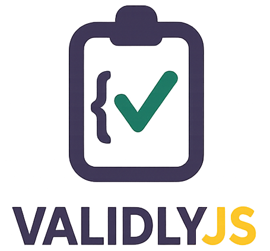

# ValidlyJS

Welcome to **ValidlyJS** documentation! This comprehensive guide will help you get started with our package and explore all its features.

ValidlyJS is a high-performance, Laravel-inspired validation library for TypeScript and JavaScript. It provides multiple validation formats, excellent TypeScript support, and built-in integrations for popular frameworks.

**Explore the documentation**: Begin from the [Introduction](./docs/intro). Check out the [Getting Started](./docs/getting-started/installation) section for detailed instructions.

## Need Help?

- 📚 Browse the comprehensive [API Reference](./docs/api/overview)
- 🐛 Report issues on [GitHub](https://github.com/tobyemmanuel/validlyjs/issues)
